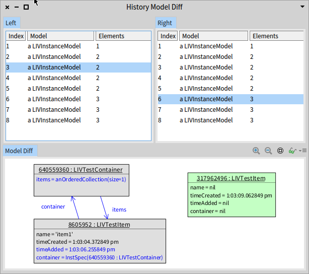
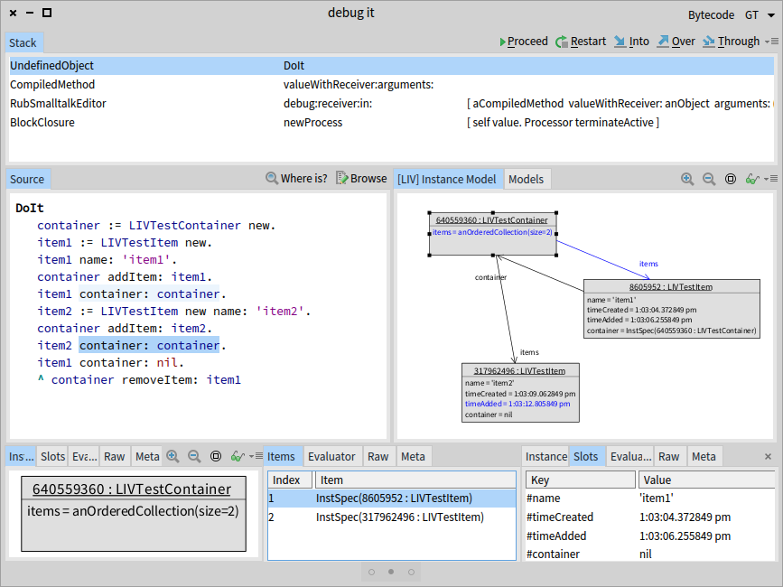
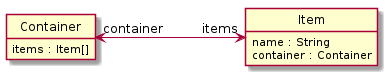

# Live Instance Viewer

Pharo utility for visualizing OO instance structure during runtime via UML instance models.

The utility hooks directly into executed code via MetaLinks, and maintains a representation of the state of objects in a UML instance-like model. Additionally it is possible to further annotate the instance model and compute new information that otherwise wouldn't be easily retrievable by analyzing the code or the program state alone.

Each change is logged in a separate model, therefore it is possible to look back through the history and see how the state evolved, or compare models at different points in time.



A custom Debugger is provided capable of displaying a model representation alongside a debugged code.



## Installation

```smalltalk
Metacello new
	baseline: 'LiveInstanceViewer';
	repository: 'github://peteruhnak/live-instance-viewer/repository';
	load.
```

## Technical Paper

For in-depth presentation, you can read a paper presented at IWST'17: [instance_visualizations_Uhnak.pdf](instance_visualizations_Uhnak.pdf)

## Example



```smalltalk
container := LIVTestContainer new.
item1 := LIVTestItem new.
item1 name: 'item1'.
container addItem: item1.
item1 container: container.

item2 := LIVTestItem new name: 'item2'.
container addItem: item2.
item2 container: container.

item1 container: nil.
container removeItem: item1.
```

```smalltalk
modelDefs := LIVInstanceCompositeSpecificationBuilder new.
modelDefs addSpec: [ :spec |
	spec classifier: LIVTestContainer.
	spec name: #identityHash.
	spec
		addSlot: #items -> [ OrderedCollection new ].
].
modelDefs addSpec: [ :spec |
	spec classifier: LIVTestItem.
	spec name: #identityHash.
	spec
		addSlot: #name -> nil;
		addSlot: #timeCreated -> [ Time now ];
		addSlot: #timeAdded -> nil;
		addSlot: #container -> nil.
].


MetaLinks registration with added custom annotations and computations.

```smalltalk
history := LIVInstanceHistory new.
LIVDebugSession modelHistory: history.
history specificationBuilder: modelDefs.

links := MTMetaLinkRegistration new.

links addLink: [ :link |
link
	target: LIVTestItem>>#initialize;
	control: #before;
	action: [ :object |
		history inNewState: [ :model | model ensureInstanceFor: object ]
	]
].

links addLink: [ :link |
link
	target: LIVTestItem>>#name:;
	action: [ :object :arguments |
		history inNewState: [ :model |
			model setValueFrom: object to: arguments first at: #name
		]
	]
].

links addLink: [ :link |
link
	target: LIVTestItem>>#container:;
	action: [ :object :arguments |
		history inNewState: [ :model |
			arguments first
				ifNil: [ 	model unsetLinkFrom: object at: #container ]
				ifNotNil: [ model setLinkFrom: object to: arguments first at: #container ]
		]
	]
].

links addLink: [ :link |
link
	target: LIVTestContainer>>#initialize;
	control: #before;
	action: [ :object |
		history inNewState: [ :model | model ensureInstanceFor: object ]
	]
].

links addLink: [ :link |
link
	target: LIVTestContainer>>#addItem:;
	action: [ :object :arguments |
		history inNewState: [ :model |
			model addLinkFrom: object to: arguments first at: #items.
			model setValueFrom: arguments first to: Time now at: #timeAdded.
"			model addLinkFrom: object to: arguments first name -> Date new at: #allItems."
		]
	]
].

links addLink: [ :link |
link
	target: LIVTestContainer>>#removeItem:;
	action: [ :object :arguments |
		history inNewState: [ :model |
			model removeLinkFrom: object to: arguments first at: #items.
		]
	]
].
	
links install.
LIVDiffBrowser openOn: history.
history inspect.

"
links uninstall
"
```